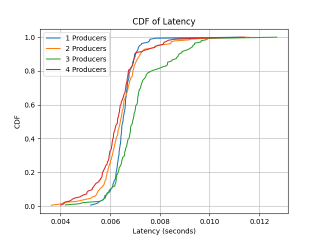

# CS5287_Cloud_Computing_Team6_Homework2

**IaC-driven Deployment and Orchestration of a Cloud-based IoT Data Analytics Pipeline using Virtual Machines and Docker**

## Goals - Key changes from PA1

In PA2, we automate the process using Infrastructure-as-Code (IaC) frameworks like Ansible, enhancing the deployment and scalability of our cloud-based IoT data analytics pipeline.

### Key Changes:
1. **Ansible Playbooks**: All manual steps from PA1 are now automated using Ansible. This includes creating the VMs, installing packages (including Docker), setting firewall rules, and configuring Kafka via playbooks.
2. **Producer Code Enhancements**: Each producer now has an additional consumer thread, which reads from the "inference result" Kafka topic and correlates results to the original image. This is crucial as we introduce multiple producers and need to track individual responses.
3. **Data Pipeline Execution**: Kafka, ZooKeeper, and MongoDB are distributed across VMs, while producers, consumers, and the ML server run in Docker containers.
4. **Workload Variation**: The workload is varied by increasing the number of producers from 1 to 4, running each inside its own container on separate VMs. Latency results are collected and analyzed to observe the system’s performance under increasing workloads.

## Technologies Used
1. **Python 3**
2. **Apache Kafka**
3. **MongoDB**
4. **Chameleon Cloud** (Ubuntu 22.04 image)
5. **CIFAR-10 dataset** (used by the IoT source)
6. **Docker**
7. **Ansible**

## Instructions for Setting Up the Environment

### 1. Python Dependencies
Install the required Python packages:
```bash
pip3 install kafka-python torch torchvision pymongo
```

### 2. Docker Setup for Apache Kafka
Pull the Kafka image:
```bash
docker pull apache/kafka
```

### 3. Download Apache Kafka
Download and set up Kafka:
```bash
wget https://downloads.apache.org/kafka/3.8.0/kafka_2.13-3.8.0.tgz
tar -xzf kafka_2.13-3.8.0.tgz
cd kafka_2.13-3.8.0
```

## Workload Variation: Experiment Results

We varied the number of producers from 1 to 4. The producers are distributed across four VMs, incrementally increasing the workload. The collected latencies for each scenario were used to generate CDF plots.

### Latency Data
Latency logs were recorded in the following files for each VM:
- `latency_vm1.log` (1 producer)
- `latency_vm2.log` (2 producers)
- `latency_vm3.log` (3 producers)
- `latency_vm4.log` (4 producers)

### CDF of Latency
Below is the CDF plot that visualizes the latency for each scenario:



## Execution Steps

1. Deploy the Kafka, ZooKeeper, and MongoDB services on separate VMs.
2. Run the producers and ML inference server inside Docker containers on the respective VMs.
3. Collect the latency data from each producer (stored in the latency logs).
4. Plot the CDF curve and analyze the system’s performance under varying workloads.

### Contributions
- **Robert Sheng**: Focused on Docker setup, workload variation experiments, and Kafka producer-consumer enhancements.
- **Youngjae Moon**: Worked on Ansible playbooks, Kafka-ZooKeeper configuration, and MongoDB setup.
- **Lisa Liu**: Led the development of the ML inference server and integrated it with Kafka.

### Team Members
- **Young-jae Moon (MS)**: youngjae.moon@vanderbilt.edu
- **Robert Sheng (BS/MS)**: robert.sheng@vanderbilt.edu
- **Lisa Liu (BS)**: chuci.liu@vanderbilt.edu

### Professor
- **Aniruddha Gokhale**: a.gokhale@vanderbilt.edu
